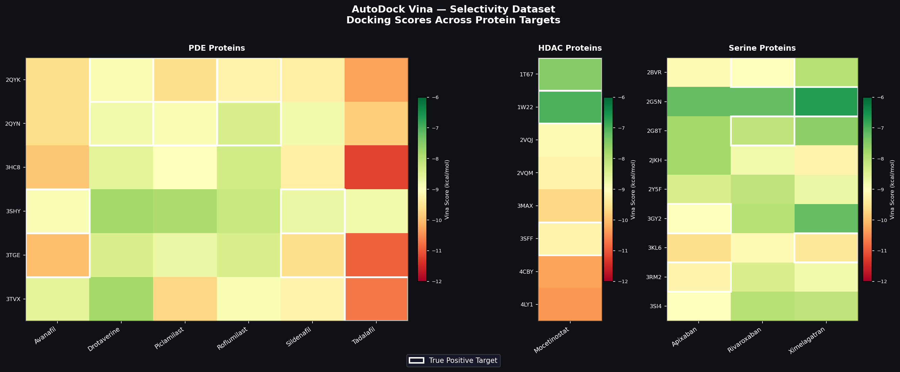

# Benchmark Datasets and Evaluation of Molecular Docking for Inverse Virtual Screening

**Abeeb Ajibade\#, Xianjin Xu\#, Claire Guo, Xiaoqin Zou**
*Department of Physics, Department of Biochemistry, Dalton Cardiovascular Research Center, and Institute for Data Science and Informatics, University of Missouri, Columbia, MO*

\# These authors contributed equally to this work.

---

## Overview

Molecular docking has achieved great success in traditional virtual screening — finding molecules that bind a known target. **Inverse virtual screening (IVS)** reverses this paradigm: given a bioactive molecule, IVS identifies which proteins it is most likely to bind across a large protein library. IVS is valuable for target identification, drug repositioning, side effect prediction, and toxicity studies.

Despite widespread use, docking-based IVS methods had not been systematically evaluated prior to this work — largely due to the absence of a suitable benchmark. This project presents:

1. An **improved Drugs/sc-PDB benchmark** of 47 diverse FDA-approved drugs and 901 human proteins with experimentally determined 3D structures
2. A **systematic evaluation** of AutoDock Vina, MDock, and a machine learning scoring function (ΔVinaXGB) for IVS
3. A **consensus scoring strategy** that further improves target enrichment


---

## IVS Pipeline

In docking-based IVS, a query ligand is docked against every protein in a target library. Proteins are then ranked by their docking scores — higher-ranked proteins are predicted as more likely targets.


**Pipeline steps:**
- **Protein library preparation** — structures from sc-PDB; binding sites defined by co-crystallized ligand positions; solvents and ions removed with UCSF Chimera
- **Ligand preparation** — 3D conformers generated from SMILES using OMEGA2; up to 200 conformers for MDock ensemble docking
- **Docking** — AutoDock Vina (rigid receptor, flexible ligand) and MDock (knowledge-based, ensemble docking)
- **Rescoring** — ΔVinaXGB ML-based rescoring applied to best Vina binding pose per target
- **Consensus scoring** — proteins re-ranked by combining Vina and MDock rank numbers

---

## Benchmark Datasets

### Drugs/sc-PDB Dataset
- **47** structurally diverse FDA-approved drugs (selected from DrugBank v6.0)
- **901** human proteins with experimentally determined 3D structures (from sc-PDB 2017)
- True positive targets identified via DrugBank; human proteins used as true negatives
- Number of true positive targets per drug ranges from 2 to 16

### Selectivity Dataset
- **10** small-molecule drugs · **8** protein targets across 3 protein families
- Contains both true positive and true negative targets — ideal for selectivity evaluation
- **PDE inhibitors:** PDE4 and PDE5 (6 drugs)
- **HDAC inhibitors:** HDAC2, HDAC4, HDAC8 (1 drug)
- **Serine proteases:** Trypsin, Thrombin, Factor Xa (3 drugs)

---

## Results

### Drugs/sc-PDB Dataset — Efficiency Factor (EF)

> EF > 50% indicates better-than-random target enrichment. EF = 50% is random selection.

| Method | Mean EF | Median EF | Cases EF > 50% |
|---|---|---|---|
| AutoDock Vina | 72.6% | 72.0% | 89.4% (42/47) |
| MDock | 74.0% | 75.9% | 93.6% (44/47) |
| ΔVinaXGB (ML rescoring) | 73.9% | 73.2% | 95.7% (45/47) |
| **Consensus Scoring** | **75.1%** | **76.9%** | **93.6% (44/47)** |

### Drugs/sc-PDB Dataset — Enrichment Curve (EC)

| Method | EC @ Top 5% (mean / median) |
|---|---|
| AutoDock Vina | 24.6% / 16.7% |
| MDock | 21.9% / 16.7% |
| ΔVinaXGB rescoring | 27.0% / 25.0% |

### Selectivity Dataset

| Method | Correct target predictions |
|---|---|
| AutoDock Vina | 9 / 10 |
| MDock | 9 / 10 |
| ΔVinaXGB | 7 / 10 |

### Selectivity Dataset — Docking Score Heatmap

Docking scores across all drug-protein pairs in the Selectivity dataset. White borders indicate true positive protein targets.



---

## Evaluation Metrics

**Efficiency Factor (EF)** — measures global ranking quality. Computed as the normalized difference between average ranks of true positive and true negative targets. EF > 50% indicates enrichment above random.

**Enrichment Curve (EC)** — plots cumulative percentage of known targets recovered vs. percentage of the ranked list screened. EC values reported at top 5%, 10%, and 20%.

**ROC-AUC** — measures discrimination between true positives and negatives across all ranking thresholds. Note: due to high class imbalance in the Drugs/sc-PDB dataset (≤16 true positives vs. ~900 negatives), EF and EC are the primary metrics.

---

## Repository Contents

```
inverse-virtual-screening/
├── selectivity_dataset_vina/       # AutoDock Vina docking results
│   ├── HDAC/results/               # Ranking files + docked poses
│   ├── PDE/results/
│   └── Serine/results/
├── selectivity_dataset_mdock/      # MDock docking results
│   ├── HDAC/results/
│   ├── PDE/results/
│   └── Serine/results/
├── generate_figures.py             # Reproduces heatmap from ranking data
├── selectivity_heatmap_vina.png    # Figure: Vina scores across Selectivity dataset
├── IVS.jpg                         # Figure: IVS concept schematic
├── workflow.jpg                    # Figure: Docking pipeline workflow
└── vina                            # AutoDock Vina executable
```

---

## Reproducing the Heatmap

```bash
git clone git@github.com:Abeeb1/inverse-virtual-screening.git
cd inverse-virtual-screening
pip install pandas matplotlib numpy
python generate_figures.py
```

---

## Publication

> Ma Z\*, **Ajibade A\*** (co-first author), Zou X. *"Docking strategies for predicting protein-ligand interactions and their application to structure-based drug design."* Commun Inf Syst. 2024;24(3):199–230.

---

## Author

**Abeeb Ajibade** — PhD Candidate, Computational Biophysics, University of Missouri
[LinkedIn](https://linkedin.com/in/abeeb-ajibade) · [GitHub](https://github.com/Abeeb1) · ajibadeabeeb95@gmail.com
